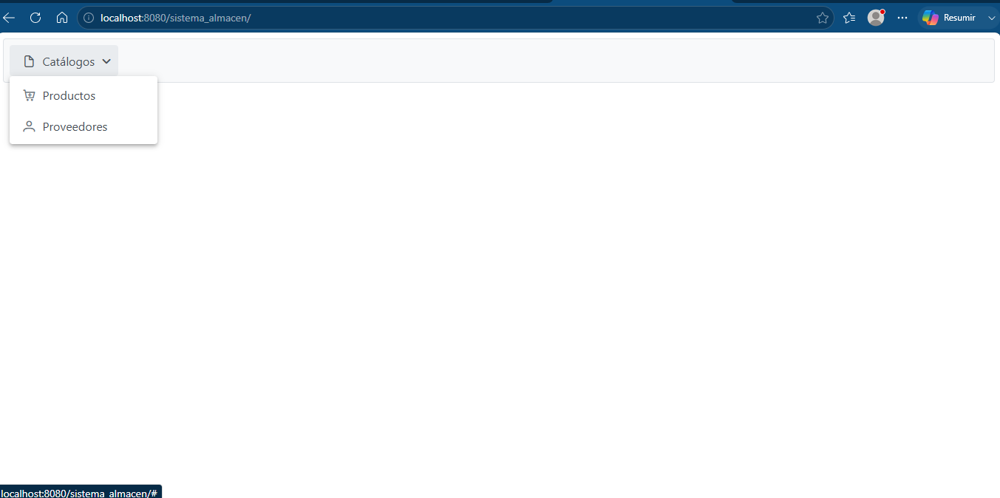
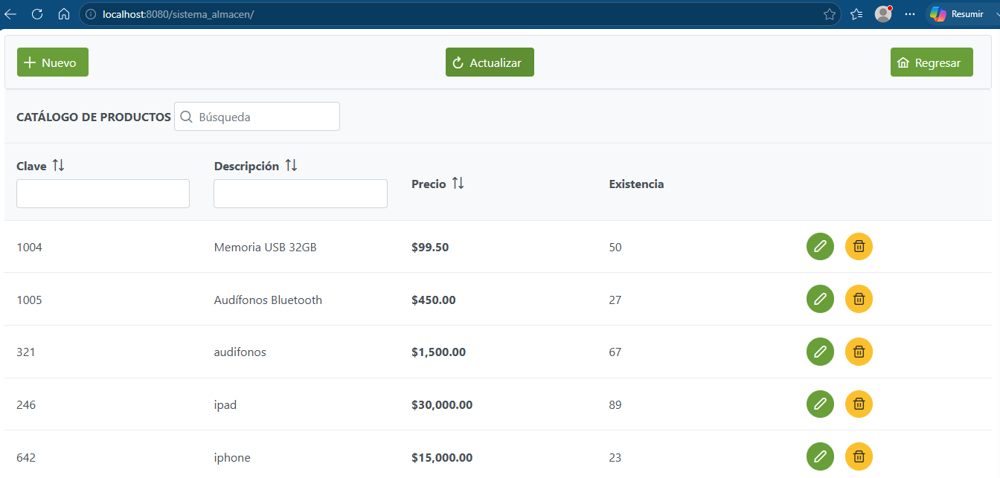
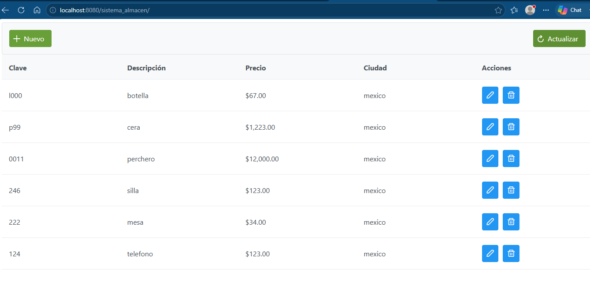

# Sistema de Almacén - Java y PostgreSQL

Este proyecto consiste en un sistema de almacén desarrollado como proyecto académico utilizando Java y PostgreSQL.

El sistema permite administrar productos y proveedores mediante una interfaz web, implementando operaciones CRUD (Crear, Consultar, Actualizar y Eliminar) conectadas a una base de datos PostgreSQL.

## Tecnologías utilizadas

- Java
- NetBeans
- PostgreSQL
- SQL
- JSF (JavaServer Faces)
- XHTML

## Funcionalidades

### Productos
- Agregar productos
- Consultar productos
- Modificar productos
- Eliminar productos

### Proveedores
- Agregar proveedores
- Consultar proveedores
- Modificar proveedores
- Eliminar proveedores

## Base de datos

La base de datos fue desarrollada en PostgreSQL e incluye:

- Tablas de productos y proveedores.
- Funciones almacenadas.
- Procedimientos almacenados.
- Consultas SQL.
- Conexión desde Java mediante JDBC.

El script de la base de datos se encuentra en el archivo:

`Sistema_almacen.sql`

## Estructura del proyecto

```
src/
web/
nbproject/
Sistema_almacen.sql
build.xml
```

## Autor
Verónica Reynoso Negrete

Estudiante de Ingeniería en Computación.

## Capturas del sistema

### Pantalla principal



### Módulo de productos



### Módulo de proveedores


